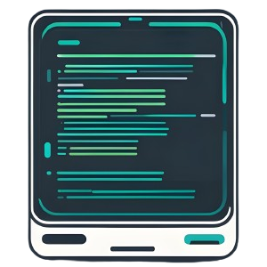

<br />
<div align="center">
  <a href="#">
    
  </a>
</div>

## Description

ai-commit is a tool designed to streamline the process of creating meaningful and descriptive commit messages. By leveraging LLMs, this tool analyzes the changes made by running `git diff --cached` and automatically generates commit messages that accurately reflect the modifications. 
**Key Features:**
- **Contextual Understanding:** Analyzes code changes to understand the context and purpose of the modifications.
- **Descriptive Messages:** Generates detailed commit messages that describe what was changed and why.
- **Customization:** Allows users to fully customize the prompts to match their project's style.
- **Integration:** Easily integrates with git by using the `prepare-commit-msg` hook.
- **Efficiency:** Saves time by automating the commit message creation process.
- **Plugins:** Integrates additional plugins to extend the context or format messages.

## Table of Contents
- [Getting started](#getting-started)
- [Plugins](#plugins)
- [Configuration](#configuration)
- [Todos](#todos)

## Getting started

You can run the tool by executing `ai-commit` to generate a commit message for the staged files. Alternatively, you can set up a hook that runs after executing `git commit`. To do this, setup the [prepare-commit-msg](https://git-scm.com/docs/githooks#_prepare_commit_msg) git hook. You can define global git hooks by setting the path:

```bash
# set hooks path
git config --global core.hooksPath /path/to/my/centralized/hooks
```

and afterwards adding the following lines to the `/path/to/my/centralized/hooks/prepare-commit-msg` file, the tool is executed after every `git commit`:

```bash
#!/bin/bash

COMMIT_MSG_FILE=$1
COMMIT_SOURCE=$2
SHA1=$3

ai-commit hook "$COMMIT_MSG_FILE" "$COMMIT_SOURCE" "$SHA1"
```

## Plugins

### Issue number integration

Integrates the issue number from the branch name into your commit message. For example, if your branch name is `feature/ISSUE-123_add-login-functionality`, the generated commit message will contain `ISSUE-123`. This feature is activated by default and can be disabled in the [configuration](#configuration) settings. This ensures that your commit messages are not only descriptive but also linked to the relevant issue, providing better traceability and context for your changes.

## Configuration

You can configure the tool by creating a `~/.ai-commit.yaml` file in your home directory. Alternatively, you can pass the configuration by adding the `--config string` parameter to the program. These are the predefined defaults:

```yaml
client:
    provider: "ollama"
    model: "llama3.2"
    apiKey: ""
    apiUrl: ""
    contextWindowSize: 12800
prompts:
    mission: |
        You are provided with a git diff output that shows code changes. Your task is to generate a structured and descriptive commit message based on the following guidelines:
        1. The commit message should have a short, one-line summary (50 characters or less) starting with one of the following keywords:
            - feat: for new features or enhancements
            - fix: for bug fixes
            - refactor: for code restructuring without changing behavior
            - docs: for documentation changes
            - test: for adding or modifying tests
            - chore: for maintenance tasks (e.g., updating dependencies)
    multiLineCommitGuidelines: |
        2. After the summary, include a detailed description explaining:
          - What has changed and why.
          - The issue the changes are addressing (if applicable).
          - Any important implications for other parts of the codebase.
    generalGuidelines: |
        3. Only output one commit message and no further explanations.
        4. Use an imperative tone (e.g., 'Fix', 'Add', 'Update').
        5. Ensure that the message is clear and concise, focusing on the intent of the changes rather than just describing the diff.
        6. Don‘t use code to explain the changes.
    diffInstructions: "Here is the git diff output:"
plugins:
    addBranchPrefix: true
multiLineCommitMessage: true
ignoredFiles: []
```

## Todos

* [ ] More providers (copilot, ..)

* [ ] Hook auto-install
* [ ] GitMojis
